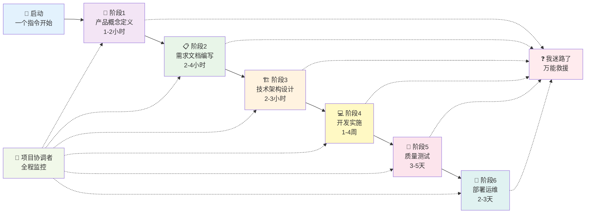

# 🌟 MetaForge Pro 黄金主线流程

> **唯一正确路径，所有复杂性都归于主线，防循环、防混乱、防迷路**

## 🎯 流程总览



---

## 📋 阶段详情

### 🚀 阶段0：启动

**触发条件**：用户输入启动指令
**输入**：用户的项目想法或描述
**输出**：激活框架，进入阶段1

```
启动指令：🚀 启动MetaForge：我想开发一个 [你的项目描述]
```

**启动检查清单**：
- [ ] 用户已表达项目想法
- [ ] MetaForge 框架已激活
- [ ] 当前任务状态已初始化
- [ ] 准备进入阶段1

---

### 👑 阶段1：产品概念定义

**负责角色**：产品概念定义师
**预计时间**：1-2 小时
**目标**：梳理产品核心概念，明确产品方向

**工作内容**：
1. 引导用户表达产品想法和目标
2. 分析目标用户群体和痛点
3. 定义产品核心价值和差异化
4. 梳理产品关键概念和边界

**输出文档**：
- `docs/product/core-concepts.md` — 核心概念文档

**质量门禁**：
- [ ] 核心概念清晰可理解
- [ ] 目标用户群体明确
- [ ] 产品价值主张清楚
- [ ] 用户确认概念文档

**退出条件**：用户确认核心概念文档 → 进入阶段2

---

### 📋 阶段2：需求文档编写

**负责角色**：版本PRD管理师
**预计时间**：2-4 小时
**目标**：基于概念编写详细的产品需求文档

**工作内容**：
1. 制定 MVP 功能范围
2. 编写用户故事和验收标准
3. 定义功能优先级
4. 规划版本路线图

**输出文档**：
- `docs/product/version-prd.md` — 版本需求文档

**质量门禁**：
- [ ] 功能需求完整覆盖核心价值
- [ ] 用户故事有明确的验收标准
- [ ] 功能优先级排序合理
- [ ] MVP 范围可控、可实现
- [ ] 用户确认 PRD 文档

**退出条件**：用户确认 PRD 文档 → 进入阶段3

---

### 🏗️ 阶段3：技术架构设计

**负责角色**：技术架构师
**预计时间**：2-3 小时
**目标**：基于需求设计技术方案和系统架构

**工作内容**：
1. 选择技术栈并说明理由
2. 设计系统整体架构
3. 设计数据库结构
4. 定义 API 接口规范
5. 评估技术风险和应对措施

**输出文档**：
- `docs/technical/tech-architecture.md` — 技术架构文档

**质量门禁**：
- [ ] 技术栈选型合理
- [ ] 架构支撑所有功能需求
- [ ] 数据库设计规范合理
- [ ] API 设计遵循 RESTful 规范
- [ ] 技术风险已识别并有应对措施
- [ ] 用户确认技术方案

**退出条件**：用户确认技术方案 → 进入阶段4

---

### 💻 阶段4：开发实施

**负责角色**：全栈开发工程师
**预计时间**：1-4 周
**目标**：基于架构设计实现所有功能

**工作内容**：
1. 搭建项目基础结构
2. 实现数据库模型和迁移
3. 开发后端 API 接口
4. 开发前端页面和交互
5. 集成前后端功能

**工作原则**：
- 模块化开发，每次完成一个完整功能模块
- 每个模块完成后进行测试验证
- 保持代码库稳定可运行
- 实时更新开发进度

**质量门禁**：
- [ ] 代码遵循编码规范
- [ ] 核心功能有单元测试
- [ ] 前后端集成正常
- [ ] 功能满足 PRD 要求
- [ ] 代码审查通过

**退出条件**：所有功能开发完成且通过质量检查 → 进入阶段5

---

### 🧪 阶段5：质量测试

**负责角色**：全栈工程师（测试模式）
**预计时间**：3-5 天
**目标**：全面测试验证，确保质量达标

**工作内容**：
1. 执行功能测试
2. 执行性能测试
3. 执行安全测试
4. 用户体验验证
5. 修复发现的问题

**质量门禁**：
- [ ] 功能测试全部通过
- [ ] 性能指标达标
- [ ] 安全扫描无高危问题
- [ ] 用户体验流畅
- [ ] 测试报告已生成

**退出条件**：所有测试通过 → 进入阶段6

---

### 🚀 阶段6：部署运维

**负责角色**：全栈工程师（部署模式）
**预计时间**：2-3 天
**目标**：部署到生产环境并建立监控

**工作内容**：
1. 配置生产环境
2. 执行数据库迁移
3. 部署应用程序
4. 配置监控和日志
5. 验证生产环境功能

**质量门禁**：
- [ ] 生产环境配置正确
- [ ] 部署成功无错误
- [ ] 核心功能生产验证通过
- [ ] 监控和告警已配置
- [ ] 回滚方案已准备

**退出条件**：生产环境验证通过 → 项目交付完成 🎉

---

## 🛡️ 4层防护系统

### 第1层：简化入口层
- 一个指令解决所有开始问题
- 无需复杂配置，即拷即用

### 第2层：角色控制层
- 每个角色强制身份标识
- 角色切换需经过质量门禁
- 防止角色混乱和职责不清

### 第3层：异常处理层
- 自动检测循环和停滞
- 万能救命指令随时可用
- 多重救援机制

### 第4层：主线流程层
- 黄金路径唯一且清晰
- 所有复杂性归于主线
- 防止分支混乱和无限循环

---

## 🆘 救援指令大全

| 指令 | 功能 | 使用场景 |
|------|------|----------|
| `❓ 我迷路了` | 查看当前状态和下一步 | 不知道当前在哪个阶段 |
| `⏸️ 暂停一切` | 暂停当前工作流程 | 需要暂停思考或休息 |
| `📊 项目进度` | 查看整体进展 | 想了解项目全局 |
| `🔄 重新开始` | 回到阶段1 | 想重新规划项目 |
| `🕵️ 逻辑检查` | 检查需求逻辑 | 觉得需求有矛盾 |
| `📋 版本规划` | 查看版本路线图 | 想了解版本计划 |
| `🎨 设计顾问` | 获取UI/UX建议 | 对界面设计有疑问 |
| `⚡ 快速评估` | 项目现状评估 | 想了解项目健康度 |

---

## ⚠️ 防循环机制

### 自动检测
- 如果同一个阶段反复执行超过 3 次，系统自动预警
- 如果文档反复修改超过 5 次，建议锁定文档

### 强制解决
- 检测到循环时，提供 3 个解决选项：
  1. 接受当前版本，继续前进
  2. 回退到上一个确认点
  3. 召唤项目协调者介入

---

**记住**：黄金路径就是最简单的路径。跟着走，永远不迷路！ 🌟
