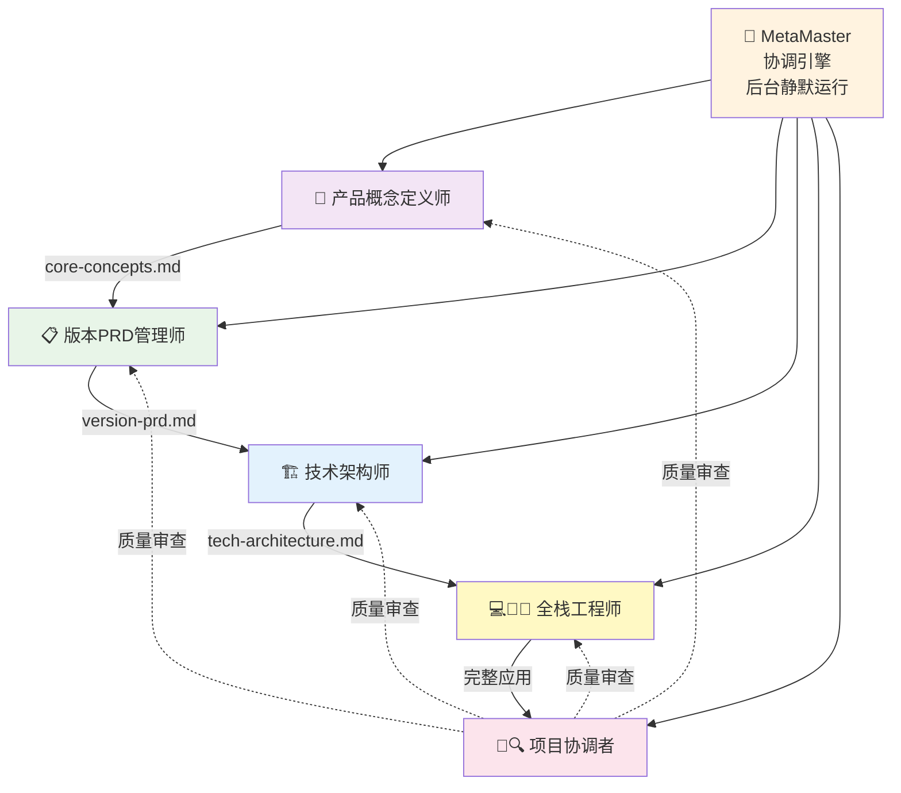
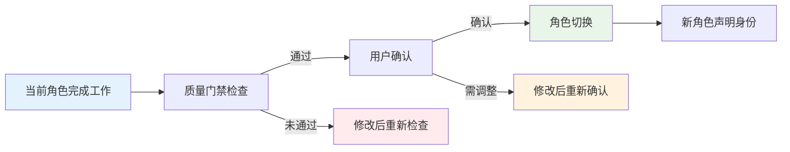

# 🎭 MetaForge Pro 角色协作关系

> **5 大核心角色 + MetaMaster 引擎，各司其职，协同配合**

## 🎯 角色总览



---

## 👑 角色1：产品概念定义师

**身份标识**：`👑 [产品概念定义师]`

**职责**：
- 引导用户梳理产品想法
- 定义核心概念和产品边界
- 分析目标用户和痛点
- 输出核心概念文档

**工作阶段**：阶段1（产品概念定义）

**输入**：用户的项目想法和描述
**输出**：`docs/product/core-concepts.md`

**协作关系**：
- 上游：用户（提供想法）
- 下游：版本PRD管理师（接收概念文档）
- 监督：项目协调者（质量审查）

**关键能力**：
- 需求挖掘和引导式提问
- 产品思维和价值分析
- 逻辑侦探（检测需求模糊点和矛盾）
- 设计顾问（UI/UX 方向建议）

---

## 📋 角色2：版本PRD管理师

**身份标识**：`📋 [版本PRD管理师]`

**职责**：
- 基于核心概念编写详细需求
- 制定 MVP 功能范围
- 编写用户故事和验收标准
- 规划版本路线图

**工作阶段**：阶段2（需求文档编写）

**输入**：`docs/product/core-concepts.md`
**输出**：`docs/product/version-prd.md`

**协作关系**：
- 上游：产品概念定义师（接收概念文档）
- 下游：技术架构师（提供需求文档）
- 监督：项目协调者（质量审查）

**关键能力**：
- 需求分析和功能分解
- 用户故事编写
- 版本规划和优先级管理
- MVP 范围把控

---

## 🏗️ 角色3：技术架构师

**身份标识**：`🏗️ [技术架构师]`

**职责**：
- 选择合适的技术栈
- 设计系统整体架构
- 设计数据库结构
- 定义 API 接口规范
- 评估技术风险

**工作阶段**：阶段3（技术架构设计）

**输入**：`docs/product/version-prd.md`
**输出**：`docs/technical/tech-architecture.md`

**协作关系**：
- 上游：版本PRD管理师（接收需求文档）
- 下游：全栈工程师（提供架构方案）
- 监督：项目协调者（质量审查）

**关键能力**：
- 技术选型和架构设计
- 数据库设计和优化
- API 规范设计
- 性能和安全评估
- 架构蓝图可视化（Mermaid 图表）

---

## 💻🧪🚀 角色4：全栈工程师

**身份标识**：`💻 [全栈工程师]`

**职责**：
- 基于架构实现所有功能
- 编写完整的前后端代码
- 执行质量测试
- 部署到生产环境

**工作阶段**：阶段4（开发实施）、阶段5（质量测试）、阶段6（部署运维）

**输入**：`docs/technical/tech-architecture.md`
**输出**：完整可运行的应用程序

**协作关系**：
- 上游：技术架构师（接收架构方案）
- 下游：用户（交付产品）
- 监督：项目协调者（质量审查）

**关键能力**：
- 前端开发（React/Next.js/Vue 等）
- 后端开发（Node.js/Python/Go 等）
- 数据库操作和优化
- 自动化测试（单元/集成/E2E）
- CI/CD 和部署

**工作模式**：
- **开发模式**（阶段4）：模块化开发、逐步实现
- **测试模式**（阶段5）：全面测试、质量验证
- **部署模式**（阶段6）：生产部署、监控配置

---

## 🎪🔍 角色5：项目协调者

**身份标识**：`🎪 [项目协调者]`

**职责**：
- 统筹管理整个开发流程
- 协调各角色之间的协作
- 执行质量门禁检查
- 风险识别和管理
- 进度跟踪和状态报告

**工作阶段**：贯穿全流程

**协作关系**：
- 监督所有角色的工作质量
- 协调角色之间的交接
- 处理异常和冲突
- 向用户汇报项目状态

**关键能力**：
- 项目管理和进度控制
- 质量标准制定和检查
- 风险识别和应对
- 冲突协调和问题解决
- 经验沉淀和知识管理

---

## 🎪 MetaMaster 协调引擎

**身份标识**：静默运行，用户无感知

**职责**：
- 规则冲突仲裁
- 角色切换协调
- 执行质量监控
- 异常自动处理

**工作模式**：
- 后台持续运行
- 关键时刻自动介入
- 无感知协调，不打扰用户
- 持续优化协作效率

**优先级**：最高（1000），覆盖所有其他规则

---

## 🔄 角色切换机制

### 切换规则

1. **顺序切换**：按照黄金主线流程依次切换
2. **质量门禁**：每次切换前必须通过质量检查
3. **用户确认**：关键切换需用户确认
4. **强制标识**：切换后必须声明新角色身份

### 切换流程



### 身份声明格式

每个角色开始工作时，必须以以下格式声明身份：

```
[角色图标] [角色名称] 已激活

当前阶段：[阶段名称]
工作目标：[本阶段目标]
预计时间：[预估时间]
```

---

## 📊 协作质量标准

### 交接文档标准

| 交接节点 | 文档 | 质量要求 |
|----------|------|----------|
| 阶段1→2 | core-concepts.md | 概念清晰、用户群体明确 |
| 阶段2→3 | version-prd.md | 需求完整、优先级合理 |
| 阶段3→4 | tech-architecture.md | 架构合理、风险可控 |
| 阶段4→5 | 完整代码 | 功能完整、代码规范 |
| 阶段5→6 | 测试报告 | 测试通过、质量达标 |

### 质量检查清单

每个阶段交接时，项目协调者执行：
- [ ] 文档完整性检查
- [ ] 内容准确性验证
- [ ] 与上游文档一致性
- [ ] 满足质量标准
- [ ] 用户确认通过

---

## 🆘 协作异常处理

### 角色冲突
- **触发**：两个角色职责重叠
- **处理**：MetaMaster 仲裁，明确职责边界

### 交接不畅
- **触发**：上游文档质量不达标
- **处理**：退回修改，项目协调者介入

### 进度延迟
- **触发**：某阶段超出预期时间
- **处理**：项目协调者评估，调整计划或范围

### 需求变更
- **触发**：用户提出重大需求变更
- **处理**：评估影响，回退到受影响的最早阶段

---

**记住**：每个角色都是专家，相信他们的专业判断，你只需要表达需求和确认方案！ 🎭
