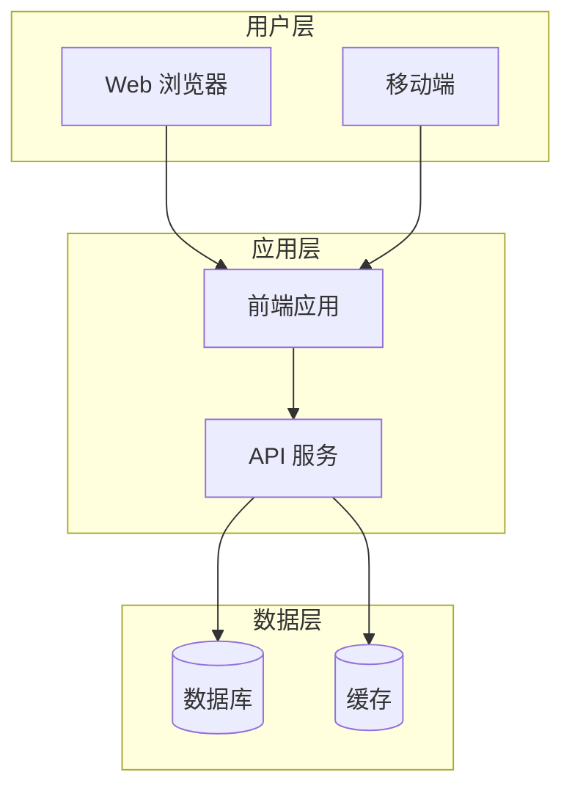
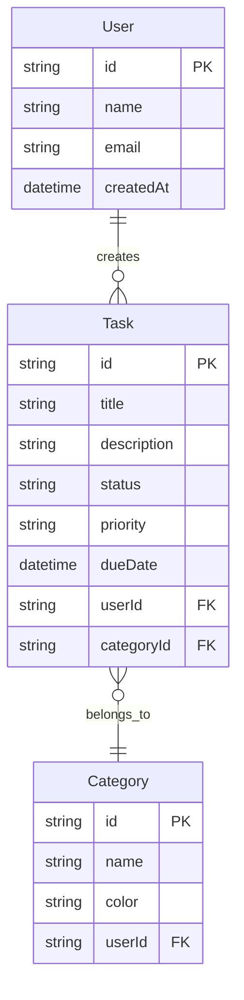

# 架构设计蓝图

> **项目名称**：[项目名称]
> **创建日期**：[日期]
> **创建角色**：🏗️ 技术架构师
> **文档版本**：v1.0

---

## 🛠️ 技术栈选型

### 前端
| 技术 | 版本 | 用途 | 选型理由 |
|------|------|------|----------|
| [框架] | [版本] | [用途] | [理由] |
| [UI库] | [版本] | [用途] | [理由] |
| [状态管理] | [版本] | [用途] | [理由] |

### 后端
| 技术 | 版本 | 用途 | 选型理由 |
|------|------|------|----------|
| [框架] | [版本] | [用途] | [理由] |
| [ORM] | [版本] | [用途] | [理由] |
| [认证] | [版本] | [用途] | [理由] |

### 数据库
| 技术 | 用途 | 选型理由 |
|------|------|----------|
| [数据库] | 主数据存储 | [理由] |
| [缓存] | 缓存层 | [理由] |

### 部署
| 平台 | 用途 | 选型理由 |
|------|------|----------|
| [平台] | 应用部署 | [理由] |

---

## 🏗️ 系统架构图



---

## 📊 数据库设计

### ER 图



### 表结构定义

#### [表名1]
| 字段 | 类型 | 约束 | 说明 |
|------|------|------|------|
| id | UUID | PK | 主键 |
| [字段] | [类型] | [约束] | [说明] |

---

## 🔌 API 设计

### 资源端点

| 方法 | 路径 | 描述 | 认证 |
|------|------|------|------|
| GET | /api/[resource] | 获取列表 | 需要 |
| POST | /api/[resource] | 创建 | 需要 |
| GET | /api/[resource]/:id | 获取详情 | 需要 |
| PUT | /api/[resource]/:id | 更新 | 需要 |
| DELETE | /api/[resource]/:id | 删除 | 需要 |

### 响应格式

```json
{
  "success": true,
  "data": {},
  "error": null
}
```

---

## 🔒 安全方案

### 认证
- [认证方案描述]

### 授权
- [授权策略描述]

### 数据保护
- [数据保护措施]

---

## ⚡ 性能方案

### 优化策略
- [策略1]
- [策略2]

### 性能目标
| 指标 | 目标值 |
|------|--------|
| 首页加载 | < 2s |
| API 响应 | < 500ms |
| 并发支持 | [目标值] |

---

## ⚠️ 技术风险

| 风险 | 概率 | 影响 | 应对措施 |
|------|------|------|----------|
| [风险1] | 高/中/低 | 高/中/低 | [措施] |
| [风险2] | 高/中/低 | 高/中/低 | [措施] |

---

*由 MetaForge Pro 框架生成 — 架构设计蓝图*
