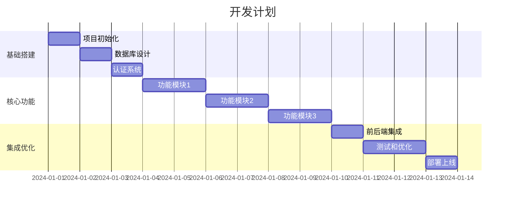

# 实现计划文档 (Plan Mode)

> **项目名称**：[项目名称]
> **创建日期**：[日期]
> **计划版本**：v1.0

---

## 🎯 目标概述

### 版本目标
- [核心目标描述]

### 成功标准
- [ ] [标准1]
- [ ] [标准2]
- [ ] [标准3]

---

## 📋 需求分析

### 功能需求
| 编号 | 功能 | 优先级 | 复杂度 | 预估工时 |
|------|------|--------|--------|----------|
| F01 | [功能1] | P0 | 高/中/低 | [X天] |
| F02 | [功能2] | P0 | 高/中/低 | [X天] |
| F03 | [功能3] | P1 | 高/中/低 | [X天] |

### 非功能需求
| 编号 | 需求 | 目标值 | 验证方法 |
|------|------|--------|----------|
| NF01 | 响应时间 | < 2s | Lighthouse |
| NF02 | 安全性 | 无高危漏洞 | 安全扫描 |

---

## 📅 开发计划

### 阶段划分



### 详细任务分解

#### 阶段1：基础搭建（X天）
- [ ] 任务1.1：[描述]
- [ ] 任务1.2：[描述]
- [ ] 任务1.3：[描述]

#### 阶段2：核心功能（X天）
- [ ] 任务2.1：[描述]
- [ ] 任务2.2：[描述]
- [ ] 任务2.3：[描述]

#### 阶段3：集成优化（X天）
- [ ] 任务3.1：[描述]
- [ ] 任务3.2：[描述]
- [ ] 任务3.3：[描述]

---

## ⚠️ 风险评估

### 技术风险
| 风险 | 概率 | 影响 | 应对措施 | 负责人 |
|------|------|------|----------|--------|
| [风险1] | 高/中/低 | 高/中/低 | [措施] | [角色] |

### 业务风险
| 风险 | 概率 | 影响 | 应对措施 | 负责人 |
|------|------|------|----------|--------|
| [风险1] | 高/中/低 | 高/中/低 | [措施] | [角色] |

---

## 📊 资源规划

### 技术资源
```yaml
开发环境:
  - [工具/环境1]
  - [工具/环境2]

第三方服务:
  - [服务1]: [用途]
  - [服务2]: [用途]
```

### 时间资源
```yaml
总工时: [X天]
每日有效工时: [X小时]
缓冲时间: [X天] (约20%)
```

---

## 🔄 Danger Mode 检查点

### 每个功能模块完成时
- [ ] 功能按需求实现
- [ ] 代码通过自检
- [ ] 基本测试通过
- [ ] 无引入新问题
- [ ] Git 已提交

### 每日结束时
- [ ] 开发日志已更新
- [ ] 任务状态已更新
- [ ] 代码已提交
- [ ] 无遗留问题

---

*由 MetaForge Pro + ClaudeCode 融合框架生成 — 实现计划*
