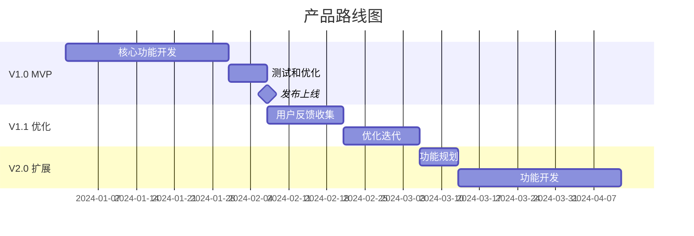

# 产品路线图

> **项目名称**：[项目名称]
> **创建日期**：[日期]
> **文档版本**：v1.0

---

## 🎯 产品使命 (Mission)

> [产品的终极愿景和使命，一句话概括]

---

## 🧑‍💼 用户画像 (Persona)

### 主要用户
- **姓名**：[虚构姓名]
- **年龄/职业**：[年龄]，[职业]
- **核心痛点**：[主要痛点]
- **使用场景**：[典型使用场景]
- **决策因素**：[影响选择的因素]

### 次要用户（如有）
- **姓名**：[虚构姓名]
- **年龄/职业**：[年龄]，[职业]
- **核心痛点**：[主要痛点]

---

## 📋 版本规划

### V1.0 MVP — 核心价值验证

**目标**：[MVP 核心目标]
**时间**：[预计时间]

**核心功能**：
| 功能 | 描述 | 优先级 | 用户价值 |
|------|------|--------|----------|
| [功能1] | [描述] | P0 | [价值] |
| [功能2] | [描述] | P0 | [价值] |
| [功能3] | [描述] | P1 | [价值] |

**成功标准**：
- [ ] [可量化指标1]
- [ ] [可量化指标2]

---

### V1.1 — 用户反馈优化

**目标**：基于 MVP 用户反馈进行优化
**时间**：MVP 发布后 2-4 周

**重点方向**：
- [优化方向1]
- [优化方向2]
- [优化方向3]

---

### V2.0 — 功能扩展

**目标**：扩展功能覆盖更多用户需求
**时间**：[预计时间]

**新增功能**：
- [功能1]
- [功能2]
- [功能3]

---

### V3.0 — 平台化/生态建设（远期）

**目标**：[长期目标]
**方向**：
- [方向1]
- [方向2]

---

## 📊 路线图可视化

---

*由 MetaForge Pro + ClaudeCode 融合框架生成 — 产品路线图*
