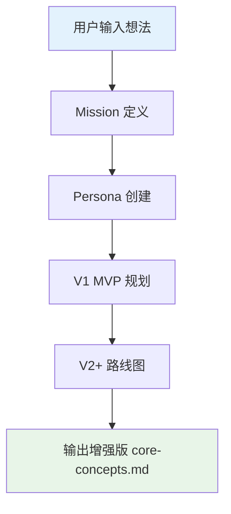
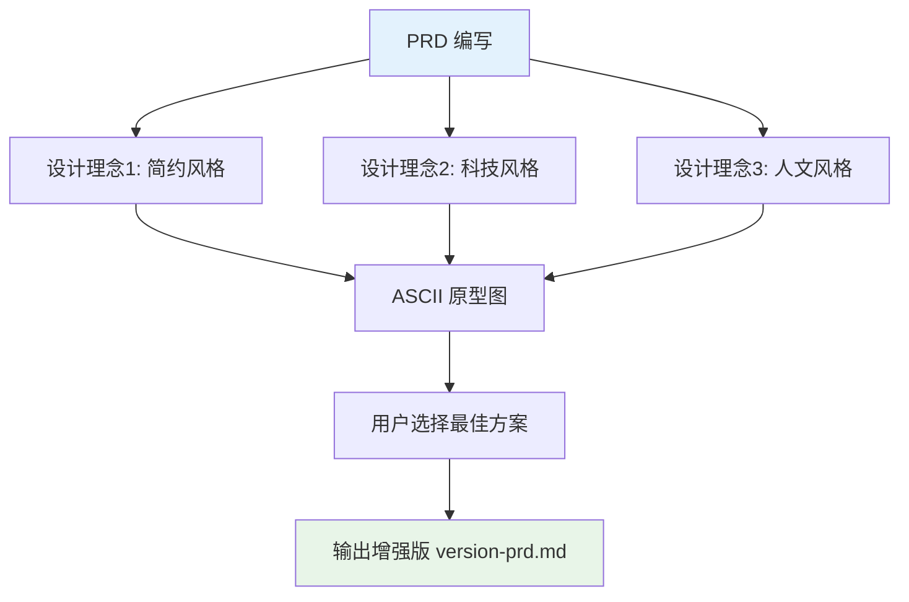

# 🎯 ClaudeCode 融合工作流

> **将 ClaudeCode 产品设计思维融入 MetaForge Pro 开发流程**

## 🌟 融合概述

ClaudeCode 融合工作流将产品设计思维（Mission-Persona-MVP-Roadmap）无缝集成到 MetaForge Pro 的 6 阶段流程中，实现产品设计驱动的开发。

## 📋 融合流程

### 增强阶段1：产品路线图制定

**传统流程**：梳理产品想法 → 输出概念文档

**融合流程**：



**Mission 定义**：
- 产品的终极愿景和使命
- 要解决的核心问题
- 期望创造的价值

**Persona 创建**：
- 典型用户画像（姓名、年龄、职业）
- 核心痛点分析
- 使用场景描述
- 决策因素排序

**MVP 规划**：
- 验证核心价值的最小功能集
- 成功标准定义
- 时间和资源估算

**路线图**：
- V1.0 → V1.1 → V2.0 → V3.0 的演进路径
- 每个版本的核心目标
- 功能扩展方向

---

### 增强阶段2：MVP 原型设计

**传统流程**：编写 PRD 文档

**融合流程**：



**3 个设计理念**：
- 为每个项目提供 3 个不同方向的界面设计理念
- 使用 ASCII 原型图直观展示
- 用户选择最符合产品气质的方向

**ASCII 原型图格式**：
```
┌─────────────────────────────────┐
│  [App Name]     [Nav]  [Menu]   │
├─────────────────────────────────┤
│                                 │
│  ┌─────────────────────────┐    │
│  │  Content Area           │    │
│  │                         │    │
│  └─────────────────────────┘    │
│                                 │
│  ┌─────────────────────────┐    │
│  │  Action Area            │    │
│  └─────────────────────────┘    │
└─────────────────────────────────┘
```

---

### 增强阶段3：架构设计蓝图

**传统流程**：技术选型 + 架构设计

**融合流程**：

**多层次可视化**：
1. 系统总体架构图（Mermaid）
2. 核心业务流程图（Mermaid）
3. 数据流转图（Mermaid）
4. 组件交互图（Mermaid）

**业务逻辑定义**：
- Business Rules 清单
- Data Contract 规范
- 数据验证规则
- 状态流转规则

---

### 增强阶段4-6：Plan Mode + Danger Mode

**Plan Mode（规划先行）**：
```yaml
在开发开始前:
  1. 深度分析需求和技术方案
  2. 制定详细的实现计划
  3. 识别风险和准备应对方案
  4. 预估每个模块的工作量
  5. 确定开发顺序和依赖关系
```

**Danger Mode（谨慎实施）**：
```yaml
在开发过程中:
  1. 每次只实现一个完整功能模块
  2. 每个功能完成后立即测试验证
  3. 保持代码库的稳定可运行状态
  4. 修改代码前评估影响范围
  5. 遇到问题及时记录和分析
```

## 🎨 设计风格配置

### 可用设计风格

| 风格 | 描述 | 适用场景 |
|------|------|----------|
| 现代简约 | 类似 Notion | 内容型应用 |
| 创意现代 | 类似 Linear | 工具型应用 |
| 商务专业 | 类似 Salesforce | 企业型应用 |
| 设计工作室 | 专为设计师 | 创意型应用 |

## 💡 融合最佳实践

1. **始终以 Mission 为导向** — 所有决策围绕产品使命
2. **Persona 驱动设计** — 功能和界面基于真实用户需求
3. **MVP 精简有力** — 只保留验证核心价值的功能
4. **可视化沟通** — 充分利用原型图和流程图
5. **Plan 充分再 Danger** — 规划到位后才谨慎实施
