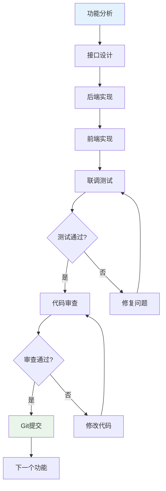

# 💻 开发执行工作流

> **详细定义开发实施阶段的执行流程、规范和最佳实践**

## 🎯 工作流概述

开发执行工作流覆盖阶段4（开发实施）、阶段5（质量测试）和阶段6（部署运维），由全栈工程师负责执行。

## 📋 开发前准备

### 检查清单

- [ ] 技术架构文档已确认
- [ ] 开发环境已配置
- [ ] 项目目录结构已创建
- [ ] 版本控制已初始化
- [ ] 编码规范已确认

### 项目初始化

```bash
# 1. 创建项目（以 Next.js 为例）
npx create-next-app@latest my-project --typescript --tailwind --app --src-dir

# 2. 安装依赖
cd my-project
npm install

# 3. 配置开发工具
# - ESLint + Prettier
# - Prisma (数据库)
# - NextAuth.js (认证)

# 4. 初始化 Git
git init
git add .
git commit -m "feat: 项目初始化"
```

## 🔄 开发迭代流程

### 功能开发流程



### 每日开发节奏

```yaml
开始工作:
  1. 回顾上次进展
  2. 确认今日目标
  3. 更新任务状态

开发过程:
  1. 按功能模块逐个开发
  2. 每完成一个模块立即测试
  3. 发现问题及时记录

结束工作:
  1. Git 提交当日进展
  2. 更新开发日志
  3. 标记完成的任务
```

## 📝 编码规范

### 目录结构规范

```
src/
├── app/                    # 页面路由
│   ├── api/                # API 路由
│   ├── (auth)/             # 认证相关页面
│   ├── (main)/             # 主应用页面
│   └── layout.tsx          # 根布局
├── components/             # React 组件
│   ├── ui/                 # 基础 UI 组件
│   ├── forms/              # 表单组件
│   └── layouts/            # 布局组件
├── lib/                    # 工具库
│   ├── db.ts               # 数据库连接
│   ├── auth.ts             # 认证配置
│   └── utils.ts            # 工具函数
├── types/                  # TypeScript 类型定义
├── hooks/                  # 自定义 Hooks
└── styles/                 # 全局样式
```

### Git 提交规范

```yaml
提交格式: <type>: <description>

类型:
  feat: 新功能
  fix: 修复 Bug
  docs: 文档变更
  style: 代码格式
  refactor: 重构
  test: 添加测试
  chore: 构建/工具变更

示例:
  - "feat: 添加用户注册功能"
  - "fix: 修复登录页面样式问题"
  - "docs: 更新 API 文档"
```

### 提交时机

```yaml
必须提交:
  - 完成一个功能模块
  - 修复一个 Bug
  - 重要的重构
  - 每日工作结束

建议提交:
  - 完成一个较大的步骤
  - 代码到达稳定状态
  - 准备切换到新任务
```

## 🧪 测试规范

### 测试分层

```yaml
单元测试:
  - 覆盖核心业务逻辑
  - 覆盖工具函数
  - 覆盖数据验证
  目标覆盖率: > 70%

集成测试:
  - 覆盖 API 端点
  - 覆盖数据库操作
  - 覆盖认证流程
  目标: 所有 API 端点

E2E 测试:
  - 覆盖核心用户流程
  - 覆盖关键业务场景
  目标: 核心流程 100%
```

## 🚀 部署流程

### 部署检查清单

- [ ] 所有测试通过
- [ ] 环境变量已配置
- [ ] 数据库迁移已准备
- [ ] 静态资源已优化
- [ ] 安全检查已通过

### 部署步骤

```yaml
1. 构建验证:
   - 本地构建成功
   - 构建产物无异常

2. 环境配置:
   - 生产环境变量
   - 数据库连接
   - 第三方服务密钥

3. 部署执行:
   - 部署到平台（Vercel/Railway 等）
   - 执行数据库迁移
   - 验证部署结果

4. 上线验证:
   - 核心功能验证
   - 性能指标检查
   - 监控告警确认
```
