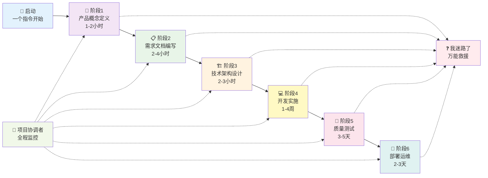

# 🌊 MetaForge Pro-一个AI多智能体协作开发标准框架

**语言 / Language**: [](README.cn.md) [](README.md)

[](mailto:lxrtc8@gmail.com) [](LICENSE) [](https://github.com/lxrtc888/MetaForge-Pro-ALL/actions/workflows/ci.yml) [](https://github.com/lxrtc888/MetaForge-Pro-ALL/stargazers) [](https://codespaces.new/lxrtc888/MetaForge-Pro-ALL) [](https://gitpod.io/#https://github.com/lxrtc888/MetaForge-Pro-ALL)

> **让任何人都能轻松开发企业级全栈应用，永远不迷路！**

## 🎯 框架简介

MetaForge Pro 是一个**防混乱、防循环、防迷路**的AI协作开发框架，专门解决AI开发中的复杂性和混乱问题。

融合了三大理论精华：

- **WaveForge** 的人机协同理念和透明化管理
- **MetaGPT** 的多智能体协作和自动化能力
- **Context Engineering** 的上下文工程方法论

### ✨ 核心特性

- 🚀 **30秒启动** - 一个指令开始，万能指令救援
- 🛡️ **4层防护系统** - 防角色混乱、防流程循环、防用户迷路
- 🎭 **5角色精简协作** - 专业分工，质量保证，强制身份标识
- 🎪 **MetaMaster协调引擎** - 总调度员，确保各组件协调一致运行
- 🌟 **黄金主线流程** - 唯一正确路径，所有复杂性都归于主线
- 🔍 **透明化状态跟踪** - 随时知道在哪里，下一步做什么
- 🆘 **智能异常处理** - 自动检测问题，多重救援机制
- 📦 **即拷即用** - 零配置，跨平台兼容

## 🚀 快速开始（30秒启动）

### **超级简单入口**

只需在Cursor中输入：

```
🚀 启动MetaForge：我想开发一个 [你的项目描述]
```

**示例**：

- `🚀 启动MetaForge：我想开发一个待办事项应用`
- `🚀 启动MetaForge：我想开发一个电商网站`

### **如果迷路了**

输入万能救命指令：

```
❓ 我迷路了，请告诉我当前状态和下一步该做什么
```

### **前置要求**

- [Cursor](https://cursor.sh/) 编辑器
- 任何操作系统 (Windows/Mac/Linux)

### **完整安装（可选）**

```bash
# 1. 下载框架
curl -L https://github.com/your-repo/MetaForge-Pro/archive/main.zip -o MetaForge-Pro.zip
unzip MetaForge-Pro.zip

# 2. 拷贝到你的项目
cp -r MetaForge-Pro/.cursor your-project/

# 3. 开始AI协作
# 在Cursor中输入："🚀 启动MetaForge"
```

## 🎭 8大专业AI角色（强制身份标识 + 质量保证）

### **阶段1：产品概念定义** 👑

**产品概念定义师** - 梳理产品核心理念和基本框架

- 🎯 帮助理清产品想法和核心概念
- 📝 输出：`core-concepts.md` 文档
- ⏱️ 用时：1-2小时

### **阶段2：需求文档编写** 📋

**需求文档管理师** - 基于概念编写详细产品需求

- 🎯 制定完整的功能需求和用户故事
- 📝 输出：`version-prd.md` 文档
- ⏱️ 用时：2-4小时

### **阶段3：技术架构设计** 🏗️

**技术架构师** - 基于需求设计技术方案和系统架构

- 🎯 选择技术栈，设计系统架构
- 📝 输出：`tech-architecture.md` 文档
- ⏱️ 用时：2-3小时
- 🔍 **质量门禁**：审查工程师验证架构合理性和三段式逻辑推理

### **阶段4：开发实施** 💻

**全栈开发工程师** - 基于架构实现所有功能

- 🎯 编写完整的前后端代码
- 📝 输出：完整可运行的应用程序
- ⏱️ 用时：1-4周
- 🔍 **质量门禁**：审查工程师检查代码质量、规范和最佳实践

### **阶段5：质量测试** 🧪

**AI测试工程师** - 全面测试验证，确保质量达标

- 🎯 执行功能、性能、安全等全面测试
- 📝 输出：`test-report.md` 测试报告
- ⏱️ 用时：3-5天
- 🔍 **质量门禁**：审查工程师评估测试覆盖率和质量标准

### **阶段6：部署运维** 🚀

**AI DevOps工程师** - 部署到生产环境并建立监控运维

- 🎯 生产部署、监控配置、运维优化
- 📝 输出：稳定运行的生产应用
- ⏱️ 用时：2-3天

### **全程协调：项目协调者** 🎪

**项目协调者** - 统筹管理整个流程，协调各角色协作

- 🎯 流程管理、风险控制、角色协调
- 📝 输出：项目状态跟踪、协调管理
- ⏱️ 工作模式：贯穿全流程，按需介入

### **MetaMaster协调引擎** 🎪

**MetaMaster** - 静默协调各组件，确保框架协调一致运行

- 🎯 规则冲突仲裁、角色切换协调、执行质量监控
- 📝 输出：无感知协调、异常自动处理、持续优化
- ⏱️ 工作模式：后台运行，关键时刻介入，用户无感知

> **🛡️ 防混乱保证：MetaMaster总协调，每个角色标明身份，项目协调者质量把控，绝不混乱！**

## 🌟 黄金主线流程（防循环设计）



### **🛡️ 4层防护系统**

1. **🚀 简化入口层** - 一个指令解决所有开始问题
2. **🎭 角色控制层** - 强制身份标识，防止角色混乱
3. **🚨 异常处理层** - 自动检测循环，提供救援机制
4. **🌟 主线流程层** - 黄金路径，所有复杂性归于主线

### **✅ 防混乱保证**

- ✅ **永远不迷路** - 随时知道在哪个阶段，下一步做什么
- ✅ **永远不循环** - 自动检测重复，强制提供解决方案
- ✅ **永远有控制权** - 用户确认才进入下一阶段
- ✅ **永远能救援** - 万能指令立即获得帮助

## 📁 框架结构（核心防护文件）

```
.cursor/
├── 🚀 QUICK_START.md      # 超级简化入口（必读）
├── 🌟 GOLDEN_PATH.md      # 黄金主线流程（必读）
├── 🎭 ROLE_COLLABORATION.md # 5角色精简协作（必读）
├── roles/                 # 5个核心AI角色
│   ├── pm-product-concept.md        # 👑 产品概念定义师
│   ├── pm-version-prd.md           # 📋 版本PRD管理师
│   ├── ai-tech-architect.md        # 🏗️ 技术架构师
│   ├── ai-full-stack-engineer.md   # 💻🧪🚀 全栈工程师(开发+测试+部署)
│   └── ai-project-coordinator.md   # 🎪🔍 项目协调者+质量审查
├── rules/                 # 5个协调规则 (优先级管理)
│   ├── 🎪 metamaster.mdc           # MetaMaster协调引擎 (优先级1000)
│   ├── 🚨 emergency-helper.mdc     # 智能应急助手 (优先级999)
│   ├── 🌟 core-workflow.mdc        # 核心工作流+质量门禁 (优先级800)
│   ├── 🎭 task-state.mdc           # 任务状态+角色控制 (优先级700)
│   └── 🧠 knowledge-system.mdc     # 知识系统+记忆管理 (优先级600)
├── templates/             # 标准化模板库
│   ├── coding-standards-template.md    # 代码规范标准模板
│   ├── review-checklist-template.md    # 审查检查清单模板
│   ├── technical-decision-template.md  # 技术决策文档模板
│   └── [其他业务模板]               # 各类业务文档模板
└── workflows/             # 详细工作流定义

examples/                  # 示例项目
├── todo-app-example/      # 待办应用示例
├── ecommerce-example/     # 电商平台示例
└── saas-platform-example/ # SaaS平台示例

tools/                     # 工具脚本
├── project-init.js        # 项目初始化脚本
└── setup.sh              # 环境设置脚本

docs/                      # 详细文档
├── troubleshooting.md     # 故障排除指南
└── best-practices.md      # 最佳实践指南
```

> **💡 新手提示：只需要读上面3个必读文档就够了，总共5分钟！**

## 🎯 适用场景（零编程基础也能用）

### 🎈 完全的编程新手

- **学习项目** - 从0开始学习全栈开发，AI手把手教学
- **个人项目** - 博客、待办应用、个人网站，不会迷路
- **技能探索** - 体验现代AI协作开发，培养产品思维

### 🏢 小团队/初创公司

- **MVP快速开发** - 3-8周交付产品原型，流程清晰可控
- **功能迭代** - 敏捷开发、快速验证，防止需求偏移
- **技术债务管理** - 代码质量、架构优化，有据可查

### 🏭 企业级应用

- **内部工具** - 管理系统、数据平台，企业级质量标准
- **客户项目** - 定制化开发、系统集成，完整交付流程
- **数字化转型** - 传统业务系统现代化，风险可控

### 🎓 教育培训

- **编程教学** - 结构化的AI协作开发教学体系
- **团队培训** - 现代化开发流程和AI协作技能培训
- **实战项目** - 真实项目开发经验，从想法到产品

## 💡 真实成功案例（防迷路验证）

| 项目类型 | 开发周期 | 用户背景     | 防混乱效果              | 技术栈                |
| -------- | -------- | ------------ | ----------------------- | --------------------- |
| 个人博客 | 1-2周    | 零编程基础   | ✅ 从未迷路，一次通过   | Next.js + Markdown    |
| 待办应用 | 3-5天    | 设计师转开发 | ✅ 清晰5阶段，无循环    | React + TypeScript    |
| 电商平台 | 4-6周    | 创业团队     | ✅ 流程透明，风险可控   | Next.js + Stripe + DB |
| 企业CRM  | 6-12周   | 传统企业     | ✅ 分阶段交付，质量达标 | 全栈 + 微服务         |
| SaaS平台 | 8-16周   | 技术团队     | ✅ 复杂项目，井然有序   | 云原生架构            |

### 🏆 用户反馈

> **"终于有一个不会让我迷路的AI开发框架了！"** - 编程新手小王
> **"复杂项目也能井井有条，团队协作效率提升300%"** - 初创公司CTO
> **"每个阶段都有明确交付，老板终于不催进度了"** - 企业开发主管

## 📚 学习资源（按重要性排序）

### **🚀 必读文档（30秒上手）**

- [超级简化入口](.cursor/QUICK_START.md) - 唯一需要的入口指南
- [黄金主线流程](.cursor/GOLDEN_PATH.md) - 防混乱的核心流程
- [角色协作关系](.cursor/ROLE_COLLABORATION.md) - 8角色完整协作图

### **📖 可选文档（深入了解）**

- [快速入门指南](docs/getting-started.md) - 详细的安装和配置说明
- [最佳实践](docs/best-practices.md) - 经验总结和优化建议
- [故障排除](docs/troubleshooting.md) - 常见问题和解决方案

### **🔧 高级功能（专业用户）**

- [角色系统详解](.cursor/roles/) - 深入了解AI角色机制
- [质量门禁系统](.cursor/rules/quality-gate.mdc) - 企业级质量控制
- [项目初始化工具](tools/project-init.js) - 自动化项目创建

> **💡 学习建议：90%的用户只需要读前3个必读文档就够了！**

## 📞 Contact

- Email: lxrtc8@gmail.com
- VX: RTC520
- Support: see [SUPPORT.md](SUPPORT.md)

## 🤝 贡献指南

欢迎为MetaForge Pro贡献力量，让它变得更简单、更不容易混乱：

### **🐛 问题反馈（最重要）**

- 报告任何让你迷路的情况
- 分享循环或混乱的体验
- 提出简化流程的建议

### **💡 功能建议**

- 新的防混乱机制
- 更好的用户引导方式
- 简化复杂流程的想法

### **📖 文档改进**

- 让文档更简单易懂
- 增加更多实用示例
- 优化新手引导内容

### **🌟 成功案例分享**

- 分享你的开发经历
- 展示防混乱效果
- 帮助其他用户避开陷阱

> **💡 贡献原则：简单优于复杂，清晰优于功能丰富**

## 📄 许可证

Apache-2.0 License - 详见 [LICENSE](LICENSE)

---

## 🌟 核心理念

> **"永远不让用户迷路，永远知道下一步该做什么"**

### **🎯 设计哲学**

- **简单性** - 一个入口指令解决所有开始问题
- **可控性** - 用户始终掌握主动权，AI永远听指挥
- **透明性** - 随时知道在哪里，要去哪里，为什么这样做
- **容错性** - 出现任何问题都有明确的解决路径

### **🚀 价值承诺**

MetaForge Pro 让每个人都能成为全栈开发者，无论你的编程基础如何。通过防混乱的AI协作和结构化的开发流程，从想法到产品只需要几周时间，**全程不迷路！**

### **🌟 立即开始**

```
🚀 启动MetaForge：我想开发一个 [你的项目描述]
```

**恭喜你即将拥有你的第一个企业级全栈应用！** 🎉

---

*MetaForge Pro - 防混乱的AI协作开发框架，让开发变得简单而可控* ✨

---

## 🔖 Topics

- AI development
- full-stack development
- AI development industry standards
