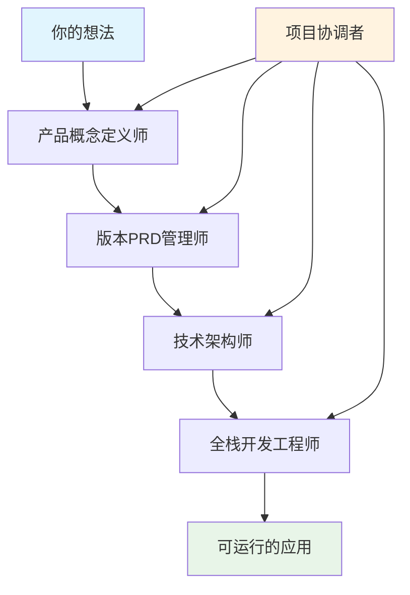

# 🚀 MetaForge Pro 快速开始指南

> **3分钟上手世界级AI协作开发框架**

## 🎯 开始前须知

### 你将收获什么
- ✅ **世界级AI协作体验** - 融合人机协同 + 智能体协作
- ✅ **企业级开发能力** - 从想法到生产就绪应用的完整开发流程
- ✅ **无需编程基础** - 专注产品思维，AI处理技术实现
- ✅ **透明化开发过程** - 实时了解AI工作状态和进展
- ✅ **持续学习优化** - 智能记忆系统不断提升协作效果

### 前置要求
- **Cursor编辑器** - [下载安装](https://cursor.sh/)
- **基础产品思维** - 能够清晰表达想法和需求
- **学习意愿** - 愿意在协作中学习和成长

## ⚡ 3分钟快速安装

### 方法1: 直接下载 (推荐)
```bash
# 1. 下载MetaForge Pro框架
curl -L https://github.com/your-org/MetaForge-Pro/archive/main.zip -o MetaForge-Pro.zip
unzip MetaForge-Pro.zip

# 2. 拷贝到你的项目目录
mkdir my-awesome-project
cp -r MetaForge-Pro/.cursor my-awesome-project/
cd my-awesome-project

# 3. 用Cursor打开项目
cursor .
```

### 方法2: Git克隆
```bash
# 1. 克隆框架仓库
git clone https://github.com/your-org/MetaForge-Pro.git

# 2. 复制框架到项目
mkdir my-awesome-project
cp -r MetaForge-Pro/.cursor my-awesome-project/
cd my-awesome-project

# 3. 用Cursor打开
cursor .
```

### 方法3: 手动拷贝
1. 下载MetaForge-Pro文件夹
2. 将`.cursor`文件夹复制到你的项目根目录
3. 用Cursor打开项目目录

## 🎪 第一次协作体验

### 步骤1: 激活MetaForge框架
在Cursor中输入以下指令：

```
你好小静！我刚刚配置了MetaForge Pro框架。

请你：
1. 检查框架配置状态
2. 激活MetaForge协作模式
3. 开始引导我进行产品开发

我是代码小白，需要你主导整个开发过程。让我们开始吧！
```

### 步骤2: 产品概念定义
AI会自动切换到**产品概念定义师**角色，引导你：

```
🎯 欢迎使用MetaForge Pro！

我是你的产品概念定义师，我们要一起定义你的产品核心概念。

请告诉我：
1. 你想开发什么类型的产品？
2. 这个想法是如何产生的？
3. 你希望解决什么问题？

我们会在讨论过程中逐步创建 `docs/product/core-concepts.md` 文档。
```

### 步骤3: 版本需求规划
概念定义完成后，AI自动切换到**版本PRD管理师**：

```
📋 核心概念已确认！现在让我们制定详细的产品需求。

基于你的核心概念，我建议我们创建 v1.0 MVP版本：
- 版本目标：验证核心价值假设
- 开发周期：4-8周
- 核心功能：[基于你的概念自动规划]

让我们开始编写详细的PRD文档...
```

### 步骤4: 技术架构设计
PRD确认后，AI切换到**技术架构师**：

```
🏗️ 需求已明确！让我设计技术架构方案。

基于你的需求，我推荐：
- 前端：Next.js + React + TypeScript + Tailwind CSS
- 后端：Node.js + Express + PostgreSQL
- 部署：Vercel + Railway

技术选型理由：[详细说明]
系统架构设计：[架构图]

你同意这个方案吗？
```

### 步骤5: 开始开发
架构确认后，AI切换到**全栈开发工程师**：

```
💻 架构方案已确认！开始开发实施。

我的开发计划：
1. 环境搭建和项目初始化 (1天)
2. 数据库设计和后端API (2-3天) 
3. 前端页面和交互开发 (3-4天)
4. 集成测试和优化 (1-2天)

我会实时更新进度到 current-task.mdc，你可以随时了解工作状态。

准备开始了吗？
```

## 📊 实时监控AI工作状态

### 查看当前任务状态
```
AI当前在做什么？
```

### 查看项目整体进度
```
项目进度如何？
```

### 查看质量检查结果
```
当前质量状况如何？
```

## 🎯 常见使用场景

### 场景1: 个人项目开发
```
我想开发一个个人博客，能够：
- 发布文章和管理内容
- 支持评论和互动
- 有清晰的分类和标签
- 响应式设计适配手机

你能帮我从概念到上线完成整个开发吗？
```

### 场景2: 小型商业应用
```
我想为我的小店开发一个库存管理系统：
- 商品入库出库管理
- 销售数据统计
- 库存预警功能
- 简单的财务报表

需要支持手机和电脑使用，你能帮我实现吗？
```

### 场景3: 创新产品原型
```
我有一个创新想法，想做一个[描述你的想法]。

我不确定技术可行性，也不知道从哪里开始。
你能帮我从产品概念开始，一步步实现这个想法吗？
```

## 🔄 AI角色和工作流程

### 5大AI角色


### 智能工作流
1. **透明化状态管理** - 随时了解AI在做什么
2. **人工确认机制** - 关键节点需要你的确认
3. **质量门禁控制** - 确保每个阶段质量达标
4. **经验智能沉淀** - 持续学习提升协作效果

## 🛠️ 高级功能

### 自定义开发要求
```
我希望在开发过程中特别注意：
1. [你的特殊要求1]
2. [你的特殊要求2]
3. [你的特殊要求3]

请在开发过程中重点关注这些要求。
```

### 技术栈偏好设置
```
我偏好使用以下技术：
- 前端：[你的偏好]
- 后端：[你的偏好]
- 数据库：[你的偏好]

请基于这些偏好进行技术选型。
```

### 开发节奏控制
```
我希望：
- 每完成一个功能就让我确认
- 每天汇报一次开发进度
- 遇到重要决策时征求我的意见

请按照这个节奏进行开发。
```

## 🆘 常见问题解决

### Q1: AI没有按照MetaForge流程工作
```
请激活MetaForge Pro框架，按照以下流程工作：
1. 检查.cursor目录下的角色和规则文件
2. 根据当前阶段激活对应角色
3. 遵循工作流程和质量标准

如果仍有问题，请重新加载框架配置。
```

### Q2: 想要修改已经确定的需求
```
我想修改之前确认的[具体内容]：
- 原来是：[原内容]
- 现在要改为：[新内容]
- 修改原因：[原因]

请评估这个修改的影响，并更新相关文档。
```

### Q3: 对AI的工作不满意
```
我对当前的[具体工作内容]不满意：
- 问题是：[具体问题]
- 我的期望是：[期望结果]

请重新分析需求，提供更好的解决方案。
```

### Q4: 想要暂停或重新开始项目
```
暂停项目：
"请暂停当前工作，保存所有进度和状态。"

重新开始：
"请重新开始项目，从产品概念定义阶段开始。"

恢复项目：
"请恢复之前暂停的项目，继续上次的工作。"
```

## 🎓 学习资源

### 深入了解MetaForge
- [角色系统详解](roles-guide.md)
- [工作流程详解](workflow-guide.md)
- [最佳实践指南](best-practices.md)
- [故障排除指南](troubleshooting.md)

### 产品思维提升
- [如何描述产品需求](product-requirements.md)
- [用户故事编写指南](user-stories.md)
- [产品验收标准](acceptance-criteria.md)

### 技术基础知识
- [全栈开发基础](fullstack-basics.md)
- [常用技术栈介绍](tech-stack-guide.md)
- [部署和运维基础](deployment-guide.md)

## 🚀 进阶使用

### 团队协作模式
```
我们团队想要使用MetaForge Pro：
- 团队规模：[人数]
- 角色分工：[具体分工]
- 协作方式：[协作模式]

请帮我们设置团队协作模式。
```

### 多项目管理
```
我想同时管理多个项目：
- 项目A：[项目描述]
- 项目B：[项目描述]

请帮我设置多项目管理模式。
```

### 自定义工作流
```
我想自定义工作流程：
- 增加：[自定义步骤]
- 修改：[修改内容]
- 删除：[删除步骤]

请帮我定制专属的工作流程。
```

---

## 🎉 开始你的AI协作开发之旅

**恭喜！** 你现在已经掌握了MetaForge Pro的基本使用方法。

记住三个关键点：
1. **你是产品经理** - 专注于产品思维和需求表达
2. **AI是开发团队** - 负责技术实现和质量保证
3. **协作是关键** - 保持沟通，及时确认，共同成长

**立即开始你的第一个项目吧！** 🚀

---

**需要帮助？**
- 📧 技术支持：support@metaforge-pro.com
- 📖 文档中心：docs.metaforge-pro.com
- 💬 社区讨论：community.metaforge-pro.com