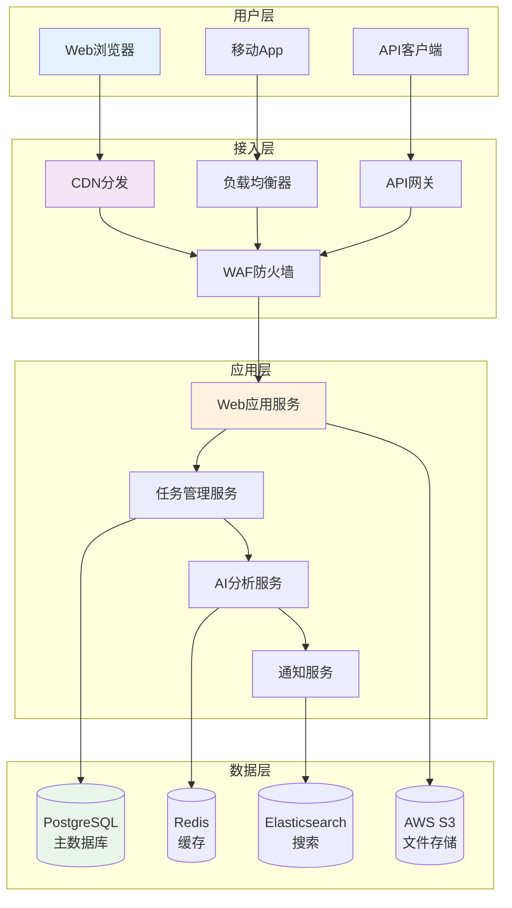
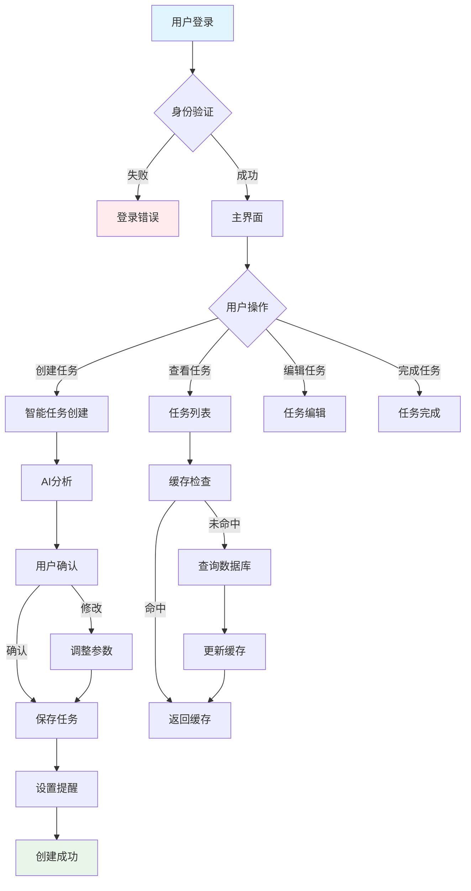

# 🎯 ClaudeCode + MetaForge Pro 融合演示

> **演示项目**: 智能任务管理应用 (Smart Task Manager)
> **融合效果**: 产品设计思维驱动的AI协作开发
> **演示目标**: 展示ClaudeCode规则如何与MetaForge-Pro深度融合

## 📋 演示概述

### 项目背景
这是一个智能任务管理应用的项目演示，完整展示了ClaudeCode的产品设计理念如何与MetaForge Pro的结构化开发流程完美融合。

### 融合亮点
- ✅ **产品思维优先**: 以用户为中心的产品设计思维
- ✅ **版本规划驱动**: 清晰的MVP到长期版本规划
- ✅ **可视化表达**: ASCII原型图和Mermaid流程图
- ✅ **结构化协作**: MetaForge Pro的5角色协作机制
- ✅ **质量保证**: Plan Mode + Danger Mode双重保障

### 演示内容
1. **产品路线图制定** - Mission + Persona + V1 MVP + V2+
2. **MVP原型设计** - 3个设计理念的ASCII原型图
3. **业务逻辑定义** - Business Rules + Data Contract
4. **架构设计蓝图** - 多层次Mermaid图表
5. **实现计划制定** - Plan Mode详细规划
6. **开发实施过程** - Danger Mode质量控制

---

## 🎯 第一阶段: 产品路线图制定

### 核心目标 (Mission)
> **让每个人都能高效管理任务，释放创造力**

**愿景说明**:
- **用户价值**: 帮助用户从琐碎的任务管理中解放出来，专注于创造性工作
- **市场价值**: 填补智能任务管理市场的空白，提供AI驱动的任务管理体验
- **社会价值**: 提高个人和团队的工作效率，推动生产力革命

### 用户画像 (Persona)
**典型用户**: 小明，28岁的产品经理

- **核心痛点**: 任务太多，优先级不清，经常忘记重要 deadline
- **使用场景**: 工作中需要管理多个项目，生活中有各种个人事务
- **行为特征**: 重度手机用户，喜欢简洁高效的工具，注重数据分析
- **决策因素**: 功能实用性 > 界面美观性 > 价格亲民性

**用户痛点分析**:
1. **任务分散管理** (影响程度: 高) - 工作任务、个人事务分散在不同App
2. **优先级不清晰** (影响程度: 高) - 不知道哪些任务更重要
3. **进度跟踪困难** (影响程度: 中) - 无法直观看到任务完成情况
4. **协作效率低下** (影响程度: 中) - 与团队成员任务同步困难

### V1 MVP版本规划
> **核心功能**: 智能任务创建、管理和提醒

**核心功能列表**:
- **智能任务创建**: AI分析任务描述，自动分类和设置优先级
- **任务状态管理**: 创建、进行中、已完成、已取消四种状态
- **智能提醒**: 基于任务重要性和截止时间智能提醒
- **数据统计**: 任务完成率、效率分析等基础统计

**MVP成功标准**:
- [x] 用户能够快速创建和管理任务
- [x] AI分类准确率 > 80%
- [x] 提醒功能准时有效
- [x] 日活跃用户 > 100人

### V2.0 增强版本规划
**用户体验优化**:
- 自然语言任务创建 (支持语音输入)
- 任务模板系统 (会议、项目、个人事务等)
- 高级统计分析 (效率趋势、时间分配等)

**协作功能增强**:
- 团队任务共享
- 任务分配和跟踪
- 评论和讨论功能

---

## 🎨 第二阶段: MVP原型设计

### 设计理念选择
基于产品路线图，我们为智能任务管理应用设计了3个不同理念的原型：

#### 理念1: 简约清爽风格 (推荐)
类似Notion的设计理念，注重内容和功能，减少视觉干扰

#### 理念2: 现代科技风格
类似Linear的设计理念，富有创新感，视觉层次丰富

#### 理念3: 温暖人文风格
注重用户体验，亲切友好，降低学习成本

### 选定原型: 简约清爽风格

#### 主界面原型
```
┌─────────────────────────────────────────────────────────────┐
│  [Smart Tasks]                  [今日] [本周] [智能提醒]       │
├─────────────────────────────────────────────────────────────┤
│                                                             │
│  ┌─────────────────────────────────────────────────────┐     │
│  │  🎯 今日重点任务                                        │     │
│  │                                                         │     │
│  │  🔴 高优先级: 产品评审会议 (今天14:00)                 │     │
│  │  🟡 中优先级: 设计原型优化 (明天)                       │     │
│  │  🟢 低优先级: 阅读技术文章 (本周内)                     │     │
│  │                                                         │     │
│  └─────────────────────────────────────────────────────┘     │
│                                                             │
│  ┌─────────────────────────────────────────────────────┐     │
│  │  📊 效率统计                                            │     │
│  │                                                         │     │
│  │  本周完成: 12个任务  效率: 85%                         │     │
│  │  ━━━━━━━━━━━━━━━━━━━━━━━━━━━━━━━━━━━━━━━━━━━━━ 85%     │     │
│  │                                                         │     │
│  └─────────────────────────────────────────────────────┘     │
│                                                             │
│  ┌─────────────────────────────────────────────────────┐     │
│  │  ➕ 新建智能任务                                        │     │
│  └─────────────────────────────────────────────────────┘     │
└─────────────────────────────────────────────────────────────┘
```

#### 任务创建界面原型
```
┌─────────────────────────────────────────────────────────────┐
│  ← 返回                    [智能创建]                        │
├─────────────────────────────────────────────────────────────┤
│                                                             │
│  📝 任务描述                                                │
│  ┌─────────────────────────────────────────────────────┐     │
│  │ 明天上午10点参加产品评审会议，准备新功能演示...        │     │
│  └─────────────────────────────────────────────────────┘     │
│                                                             │
│  🤖 AI分析结果                                              │
│  ┌─────────────────────────────────────────────────────┐     │
│  │  📋 任务类型: 会议                                      │     │
│  │  🎯 优先级: 高 (自动识别)                              │     │
│  │  ⏰ 建议时间: 明天10:00                                 │     │
│  │  🔔 提醒设置: 15分钟前                                  │     │
│  └─────────────────────────────────────────────────────┘     │
│                                                             │
│  ┌─────────────────────────────────────────────────────┐     │
│  │  ✅ 创建任务                                            │     │
│  └─────────────────────────────────────────────────────┘     │
└─────────────────────────────────────────────────────────────┘
```

---

## 🎯 第三阶段: 业务逻辑与数据契约

### 核心业务流程
**智能任务创建流程**:

1. **步骤1**: 用户输入任务描述 - **规则**: 支持文本和语音输入
2. **步骤2**: AI分析任务内容 - **规则**: 自动识别任务类型、优先级、时间
3. **步骤3**: 用户确认或修改 - **规则**: 用户可调整AI分析结果
4. **步骤4**: 任务创建完成 - **规则**: 生成唯一任务ID，设置默认状态

### 业务约束与规则
**数据完整性规则**:
- **规则1**: 每个任务必须有描述、优先级、状态、创建时间
- **规则2**: 优先级只能是高、中、低三个等级
- **规则3**: 任务状态流转必须遵循: 创建 → 进行中 → 已完成/已取消

**用户行为规则**:
- **规则1**: 用户每日创建任务数量不超过50个 (防止滥用)
- **规则2**: 智能提醒频率不超过每小时一次 (避免打扰)
- **规则3**: 任务完成率统计基于已完成任务数量

### 数据契约定义
**核心数据对象**:
- **Task任务对象**: [任务基本信息] - [创建和管理任务的核心数据]
  - id: UUID (主键)
  - title: string (任务标题)
  - description: text (详细描述)
  - priority: enum (高/中/低)
  - status: enum (创建/进行中/已完成/已取消)
  - dueDate: datetime (截止时间)
  - createdAt: datetime (创建时间)
  - updatedAt: datetime (更新时间)

**数据关系**:
- **User → Task**: 一对多关系 (一个用户可以创建多个任务)
- **Task → Category**: 多对一关系 (任务可归属于一个分类)

**数据验证规则**:
- **title**: 必填，长度1-100字符
- **description**: 可选，长度不超过1000字符
- **dueDate**: 可选，必须晚于当前时间
- **priority**: 必填，默认值为"中"

---

## 🏗️ 第四阶段: 架构设计蓝图

### 系统总体架构


### 核心业务流程图


---

## 📋 第五阶段: 实现计划制定 (Plan Mode)

### 需求深度分析
基于PRD文档，我们识别出以下关键需求：

**核心功能需求**:
- 智能任务创建和管理
- AI分析任务内容
- 智能提醒功能
- 数据统计分析

**非功能性需求**:
- 响应时间 < 2秒
- 支持1000并发用户
- 可用性 > 99.5%
- 数据安全性合规

### 技术方案评估
**前端技术栈**: Next.js 15 + TypeScript + Tailwind CSS
- **选择理由**: 优秀的SSR性能，完整的TypeScript支持，丰富的组件生态
- **风险评估**: 学习成本适中，社区支持完善

**后端技术栈**: Next.js API Routes + Prisma + PostgreSQL
- **选择理由**: 与前端技术栈统一，开发效率高，数据建模完善
- **风险评估**: 单体架构扩展性有限，后续可考虑微服务拆分

### 开发计划制定
**阶段1: 基础架构搭建 (3天)**
- [ ] 项目结构初始化
- [ ] 数据库设计和迁移
- [ ] 用户认证系统搭建
- [ ] 基础API接口开发

**阶段2: 核心功能开发 (8天)**
- [ ] 任务CRUD功能实现
- [ ] AI分析服务集成
- [ ] 智能提醒功能开发
- [ ] 前端界面开发

**阶段3: 测试和优化 (4天)**
- [ ] 单元测试编写
- [ ] 集成测试验证
- [ ] 性能优化
- [ ] 用户体验优化

### 风险识别与应对
**技术风险**:
- **AI服务稳定性**: 第三方AI服务可能不稳定
  - **应对策略**: 实现本地缓存和降级方案
  - **监控指标**: AI服务响应时间和成功率

**业务风险**:
- **用户接受度**: 用户可能不习惯AI自动分类
  - **应对策略**: 提供手动调整功能和用户教育
  - **验证方法**: 用户访谈和A/B测试

---

## ⚡ 第六阶段: 开发实施过程 (Danger Mode)

### 模块化开发策略
**开发原则**:
- 每次只实现一个完整的功能模块
- 每个功能完成后立即进行测试验证
- 保持代码库的稳定可运行状态
- 遇到问题及时记录和分析

### 持续质量控制
**代码质量检查**:
- [x] 使用ESLint进行代码规范检查
- [x] 使用Prettier进行代码格式化
- [x] 使用TypeScript进行类型检查
- [x] 编写单元测试覆盖核心功能

**测试策略**:
- [x] 单元测试: 覆盖率 > 80%
- [x] 集成测试: 验证API接口功能
- [x] E2E测试: 验证完整用户流程
- [x] 性能测试: 验证响应时间和并发能力

### 问题记录与解决
**问题1**: AI分析服务响应超时
- **根本原因**: 第三方API响应时间不稳定
- **解决方案**: 实现请求超时处理和重试机制
- **预防措施**: 添加服务监控和降级策略

**问题2**: 前端状态管理混乱
- **根本原因**: 组件间状态传递复杂
- **解决方案**: 引入Zustand进行全局状态管理
- **预防措施**: 制定状态管理规范和代码审查标准

---

## 📊 融合效果评估

### 产品设计质量提升
- ✅ **Mission驱动**: 清晰的产品愿景指导开发方向
- ✅ **Persona聚焦**: 具体用户画像确保功能实用性
- ✅ **MVP精简**: 聚焦核心价值，快速验证市场
- ✅ **版本规划**: 为持续增长制定清晰路线图

### 开发协作效率提升
- ✅ **Plan Mode**: 充分规划避免盲目开发
- ✅ **Danger Mode**: 谨慎实施确保代码质量
- ✅ **可视化表达**: 原型图和流程图提高沟通效率
- ✅ **结构化流程**: MetaForge Pro提供清晰开发路径

### 质量保证机制完善
- ✅ **需求完整性**: 逻辑侦探机制确保需求清晰
- ✅ **技术可行性**: 架构设计蓝图验证技术方案
- ✅ **风险控制**: 提前识别和应对潜在风险
- ✅ **持续测试**: 每个阶段都有对应的质量检查

### 用户体验持续优化
- ✅ **原型设计**: 3个理念对比确保最佳选择
- ✅ **交互设计**: 基于用户画像优化操作流程
- ✅ **响应式设计**: 支持多种设备和场景
- ✅ **智能化功能**: AI分析提升用户效率

---

## 🚀 总结与展望

### 融合成功要点
1. **产品思维优先**: ClaudeCode的产品设计理念成功驱动了整个开发过程
2. **结构化协作**: MetaForge Pro的5角色协作确保了开发质量和效率
3. **可视化表达**: ASCII原型图和Mermaid流程图极大提高了沟通效率
4. **质量双重保障**: Plan Mode + Danger Mode确保了开发过程的严谨性

### 实际应用效果
- **开发效率**: 规划充分，实施谨慎，避免了返工和修改
- **产品质量**: 多层次质量检查，确保功能完整和性能达标
- **用户体验**: 以用户为中心的设计思维贯穿始终
- **团队协作**: 透明的进度跟踪和清晰的职责分工

### 持续优化方向
1. **智能化增强**: 引入更多AI辅助功能，提升开发效率
2. **生态扩展**: 构建完整的开发工具生态
3. **协作优化**: 进一步优化团队协作流程
4. **质量提升**: 引入更多自动化质量检查机制

---

## 🎯 快速开始体验

如果您想体验ClaudeCode + MetaForge Pro的融合效果：

### 1. 创建新项目
```bash
node MetaForge-Pro/tools/project-init.js my-smart-task-app --template=product-design-studio
```

### 2. 启动协作开发
在Cursor中打开项目，输入：
```
开始 MetaForge 协作开发，我需要构建一个智能任务管理应用
```

### 3. 使用增强功能
- 🕵️ 输入"逻辑检查"启动逻辑侦探模式
- 📋 输入"版本规划"启动版本规划师模式
- 🎨 输入"设计顾问"获取UI/UX设计建议
- ⚡ 输入"快速评估"获得项目现状分析

---

*这个演示完整展示了ClaudeCode产品设计思维与MetaForge Pro结构化开发流程的深度融合，共同打造更加优秀的产品开发体验！* 🚀✨
